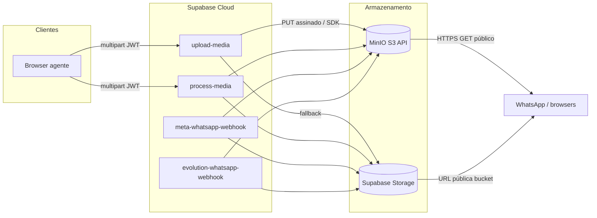
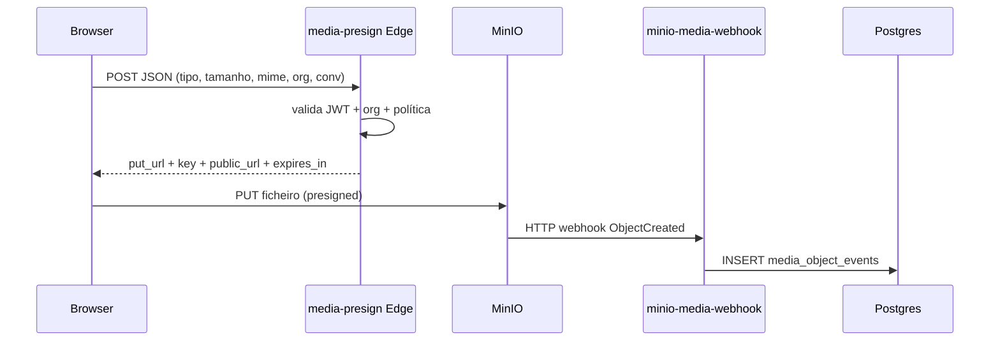
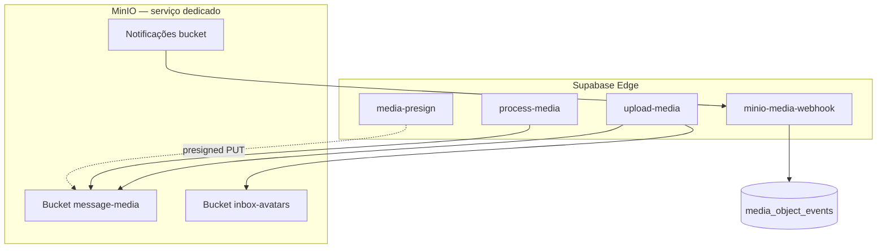

# Arquitetura de mídia: MinIO dedicado + Supabase Edge Functions

Este documento descreve o desenho alvo e o estado actual do sistema **Agents Labs / omni-chat** para armazenamento de ficheiros de conversas (imagens, áudio, vídeo, PDF), com **MinIO (S3)** como backend preferencial e **Supabase Storage** como fallback transparente.

---

## 1. Inventário — pontos de entrada de mídia

| Origem | Caminho técnico | Destino típico | Autenticação |
|--------|-----------------|----------------|--------------|
| **Agente (browser)** — anexo de mensagem | `uploadMessageAttachment` → `upload-media` (multipart) ou Storage directo | `message-media/{org}/{conv}/{uuid}.ext` | JWT Supabase + `organization_members` |
| **Agente** — compressão de imagem antes de enviar | `ConversationsPage` → `process-media` | Mesmo bucket, chaves derivadas | JWT (limite próprio **6 MB** base64 na função, independente dos 10/500 MB de anexo) |
| **Avatar de inbox** | `upload-media` `kind=inbox_avatar` | `inbox-avatars/{org}/…` | JWT + canal na org |
| **WhatsApp Cloud (Meta)** | `meta-whatsapp-webhook` → download Graph + upload | `message-media/…` | Assinatura Meta + `_internal_process` |
| **WhatsApp Evolution** | `evolution-whatsapp-webhook` — base64 / API / URL remota | `message-media/…` | Query `channel_id` + config caixa |
| **Diagnóstico** | `media-pipeline-diagnostic` (multipart opcional) | `__diagnostic__/` | JWT ou política da função |

Ficheiros relacionados (referência): `src/lib/messageAttachmentUpload.ts`, `supabase/functions/upload-media/index.ts`, `process-media`, `meta-whatsapp-webhook`, `evolution-whatsapp-webhook`, `src/pages/ConversationsPage.tsx`.

---

## 2. Fluxos de dados (estado actual)



**Decisão de backend:** se `S3_MEDIA_*` + `MEDIA_PUBLIC_BASE_URL` estão definidos nas secrets da função e o PUT a partir da Edge alcança o endpoint, o objecto vai para **MinIO**. Caso contrário (ou `S3_MEDIA_DISABLE_EDGE_PUT=true`), usa-se **Supabase Storage** sem alterar o contrato JSON devolvido ao cliente (`url`, `path`, `mime_type`, `signed_url` opcional).

---

## 3. Política de formatos e limites (modo recomendado)

| Categoria | MIME (principal) | Tamanho máximo |
|-----------|------------------|----------------|
| Imagem | `image/jpeg`, `image/png`, `image/webp` | **10 MB** |
| Áudio | `audio/mpeg`, `audio/wav`, `audio/wave`, `audio/x-wav` | **50 MB** |
| Vídeo | `video/mp4`, `video/webm` | **500 MB** |
| Documento | `application/pdf` | **10 MB** (mantido para conversas com PDF) |

**Rollback / legado:** definir secret `MEDIA_LEGACY_ATTACHMENTS=true` nas Edge Functions e `VITE_MEDIA_LEGACY_ATTACHMENTS=true` no frontend restaura o conjunto anterior (10 MB único para todos, GIF/OGG/WebM áudio, etc.). Ver `supabase/functions/upload-media` e `src/lib/messageAttachmentUpload.ts`.

---

## 4. Segurança e permissões

- **Upload browser:** validação de sessão (`getUser`), verificação de membership na organização (service role após JWT).
- **MinIO:** credenciais só nas Edge secrets; o browser **não** recebe access key — apenas URLs públicas ou pré-assinadas de leitura quando aplicável.
- **Webhooks externos:** Meta (assinatura), Evolution (`channel_id` + dados de canal), MinIO notificações (segredo dedicado `MINIO_WEBHOOK_SECRET` ou `INTERNAL_HOOK_SECRET`).
- **Supabase Storage RLS:** políticas em `storage.objects` para `message-media` (upload autenticado, leitura pública conforme migrações).

---

## 5. Novos componentes (arquitetura alvo)

### 5.1 Upload assíncrono via URL pré-assinada (PUT directo ao MinIO)

Reduz carga na Edge para ficheiros grandes (vídeo até 500 MB): o cliente pede um **presigned PUT** à função `media-presign`, envia o ficheiro **directamente** ao MinIO, e opcionalmente o MinIO notifica o Supabase.



**Requisitos:** `S3_MEDIA_*` configurado; o cliente deve usar o mesmo `Content-Type` que foi usado na geração da assinatura.

**Nota:** O fluxo presign **não** passa pelo corpo de `upload-media`, logo **não** aplica `MEDIA_SCAN_WEBHOOK_URL` nem magic bytes no servidor antes do PUT. Para antivírus neste fluxo, use notificação MinIO → `minio-media-webhook` → fila/worker que descarrega o objecto e chama o scanner, ou um *lambda* MinIO (se disponível).

### 5.2 Webhook MinIO → Supabase

- Função **`minio-media-webhook`**: `verify_jwt = false`, autenticação por `Authorization: Bearer <MINIO_WEBHOOK_SECRET>` (ou `INTERNAL_HOOK_SECRET` se preferir um só segredo).
- Tabela **`media_object_events`**: registo append-only para suporte e pipelines (ver migração `20260324200000_media_object_events.sql`).

Configuração MinIO (consola ou `mc`): *Bucket → Notifications → Target* apontando para  
`https://<project>.supabase.co/functions/v1/minio-media-webhook` com header de autorização. O formato exacto do corpo varia (compatível S3); a função tenta extrair `bucket`, `key` e `eventName`.

### 5.3 Políticas de bucket MinIO (exemplo)

Documentação MinIO: [Bucket Policy](https://min.io/docs/minio/linux/administration/identity-access-management/policy-based-access-control.html) e *anonymous* apenas se necessário para leitura pública alinhada com `MEDIA_PUBLIC_BASE_URL`.

Exemplo **privado** (só credenciais da app; leitura pública via prefixo ou política separada):

```json
{
  "Version": "2012-10-17",
  "Statement": [
    {
      "Effect": "Allow",
      "Principal": { "AWS": ["arn:aws:iam::123456789012:root"] },
      "Action": ["s3:GetObject", "s3:PutObject", "s3:DeleteObject"],
      "Resource": ["arn:aws:s3:::message-media/*"]
    }
  ]
}
```

Ajuste `Principal` à política gerada pelo MinIO para o utilizador de serviço. Para **leitura anónima** no mesmo host da CDN (como o WhatsApp exige URL acessível), muitos deployments usam política de bucket `download` em `message-media` com prefixo público — alinhar com o que já documentado em `docs/SUPABASE_CLOUD_MINIO_SECRETS.md`.

---

## 6. Validação de conteúdo e antivírus

| Camada | Implementação |
|--------|----------------|
| **Tipo declarado vs bytes** | Verificação de assinatura (magic bytes) em `upload-media` para o modo não-legado (JPEG/PNG/WEBP/MP3/WAV/MP4/WEBM). |
| **Antivírus** | **Não executado dentro da Edge** de forma nativa. Opções: (1) variável `MEDIA_SCAN_WEBHOOK_URL` + `MEDIA_SCAN_WEBHOOK_SECRET` — POST do ficheiro a um serviço externo (ClamAV sidecar, Cloudmersive, etc.); (2) fila + worker noutro runtime; (3) bucket scanning da cloud (se migrar para S3 AWS). Sem URL configurada, o passo é ignorado. |

---

## 7. Retries e rollback automático

- **PUT MinIO na Edge:** já existe retry com backoff em `upload-media` (`s3PutObjectWithRetry`).
- **Cliente:** `fetchWithTimeoutAndRetry` em `messageAttachmentUpload.ts` para erros HTTP retryable.
- **Rollback de política:** `MEDIA_LEGACY_ATTACHMENTS` / `VITE_MEDIA_LEGACY_ATTACHMENTS` sem redeploy de código.
- **Rollback de backend:** `S3_MEDIA_DISABLE_EDGE_PUT=true` força Storage; remover volta a tentar MinIO primeiro.

---

## 8. Manual de operações (suporte)

1. **401 em funções internas:** verificar `INTERNAL_HOOK_SECRET` / `MINIO_WEBHOOK_SECRET` nos headers do cron ou do MinIO.
2. **PUT timeout / AbortError:** MinIO não alcançável a partir da cloud Supabase — ver `docs/SUPABASE_CLOUD_MINIO_SECRETS.md`; ou `S3_MEDIA_DISABLE_EDGE_PUT=true` + Storage.
3. **403 em GET público:** política de bucket ou nginx só a servir GET; WhatsApp precisa de 200 no URL do anexo.
4. **Fila Meta:** `process-webhook-ingest` — ver `docs/SCALING_WEBHOOKS_AND_CAMPAIGNS.md`.
5. **Auditoria de uploads MinIO:** consultar `select * from media_object_events order by created_at desc limit 100;` (SQL no painel).
6. **Cliente não envia vídeo grande:** confirmar modo não-legado desligado e usar fluxo `media-presign` + PUT directo.

---

## 9. Diagrama lógico — serviço de mídia dedicado



---

## 10. Migração transparente para clientes finais

- Contratos JSON de `upload-media` mantidos (`url`, `path`, `mime_type`, `file_name`, `signed_url`).
- Limites mais permissivos para áudio/vídeo **aumentam** capacidade sem quebrar clientes que já enviavam só imagens pequenas.
- Clientes que dependiam de **GIF ou OGG** devem activar modo legado até actualizarem conteúdo ou UI.

---

## 11. Referências de código

- Política partilhada (referência + testes Deno): `supabase/functions/_shared/media-upload-policy.ts`
- Secrets: `supabase/functions/secrets.env.example`
- Funções novas: `media-presign`, `minio-media-webhook`
- Deploy: `supabase functions deploy upload-media process-media media-presign minio-media-webhook`
